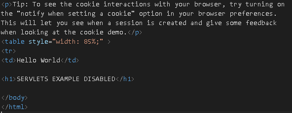

# Configuración de Apache Tomcat

## Configuración de accesos


## Configuración de HTTPS


El ".keystore" se encuentra dentro del directorio $HOME/tomcatT2/conf


Para la generación del ".keystore" se ha utilizado el siguiente comando:

``` {.cmd-output}
keytool -genkey -alias tomcat -keyalg RSA -keystore .keystore
```

Donde la contraseña asignada es: **twcam22**

## Configuración de la base de datos de usuarios


## Desactivación de los Servlets de Ejemplo



## Peticiones al servidor:


